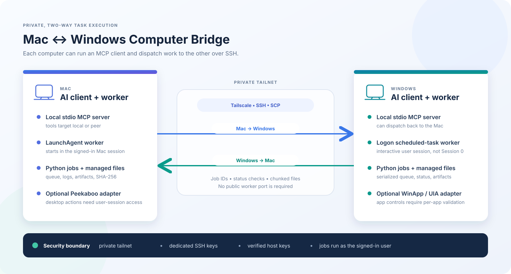
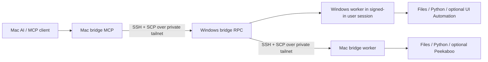

# Mac ↔ Windows Computer Bridge

A small, private-by-network bridge for running file, Python, and desktop jobs between a Mac and a Windows PC. Tailscale provides private reachability; SSH authenticates each direction; a local MCP server exposes the remote worker to an AI client.

See [`docs/IMAGES.md`](docs/IMAGES.md) for adding or replacing repository images.

## What is included

- `src/computer_bridge.py`: standard-library Python MCP server, persistent queue, job store, file transfer, SSH peer calls, and desktop adapters.
- `scripts/install_macos.sh`: installs the Mac worker as a user LaunchAgent and registers the MCP server.
- `scripts/install_windows.ps1`: installs the Windows worker as a logon scheduled task, fetches pinned WinApp CLI, and registers the MCP server.
- `scripts/remove_windows_worker.ps1`: removes the Windows task and MCP registration while preserving job data.
- `docs/`: setup, operation, Windows worker/server behavior, security, and troubleshooting.
- `benchmarks/`: CPU and PyTorch CUDA/MPS benchmark scripts.

## Quick start

1. Install and sign in to Tailscale on both computers. Confirm each can reach the other over the tailnet.
2. Enable OpenSSH Server on both computers and configure a dedicated Ed25519 key for each direction. Verify host fingerprints out of band; never disable strict host-key checking.
3. Follow [`docs/SETUP.md`](docs/SETUP.md), first on Windows, then on Mac. Customize SSH aliases and identity paths for your environment.
4. Restart the AI client on both computers so it reloads the `computer-bridge` MCP entry.
5. Run the read-only smoke checks in [`docs/OPERATIONS.md`](docs/OPERATIONS.md) before trying file writes or desktop actions.

## Important boundaries

- The Windows worker is a **user-session worker**, not a Windows service. It starts at interactive logon. A disconnected, locked, or logged-out desktop may not support UI automation.
- SSH and MCP calls do not grant elevated rights. Jobs run with the logged-in user's permissions.
- Desktop input is serialized and can conflict with a person using the same mouse/keyboard. Pause desktop automation before taking over through another remote-control tool.
- File tools use 256 KiB chunks and SHA-256 verification; the current per-file limit is 256 MiB.
- Do not expose the worker or RPC spool directories to the public internet. Do not put private keys, real host fingerprints, personal hostnames, or job outputs in source control.
- The bridge is a prototype. Read [`docs/SECURITY.md`](docs/SECURITY.md) before using it with sensitive data.

## Verification status

The two-way MCP path has passed 10 short job submissions in each direction in the originating setup. The Mac MPS and CPU benchmark scripts also completed there. These are environment-specific observations, not universal performance claims. Windows CUDA, large-file transfer, office workflows, and desktop-write acceptance remain separate tests; see [`docs/VALIDATION.md`](docs/VALIDATION.md).

## License

No open-source license has been selected for this repository. Public visibility does not by itself grant permission to reuse or redistribute the code.
